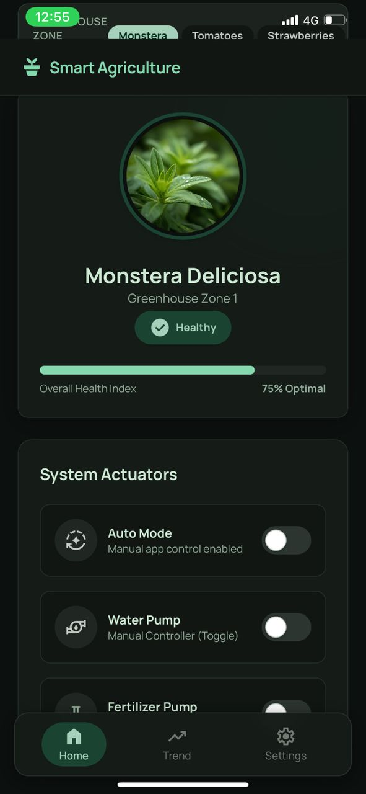
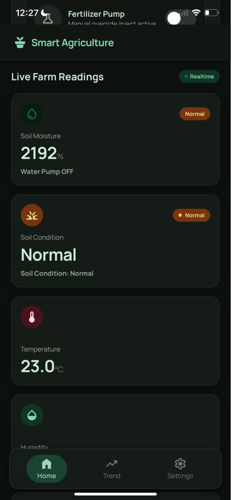
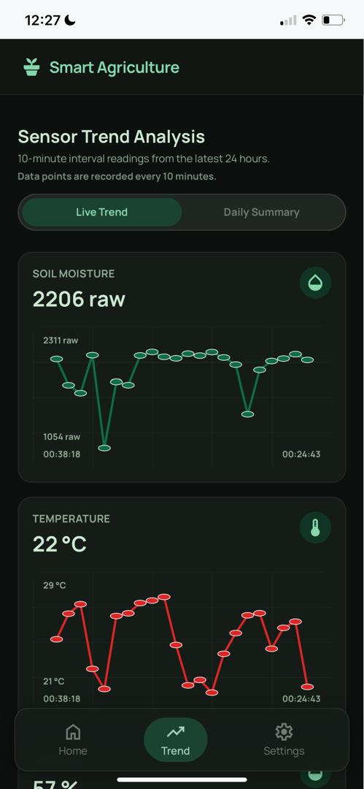
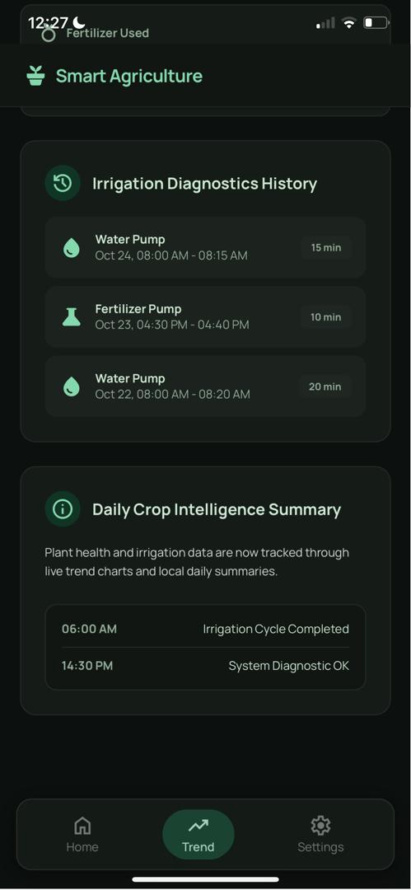
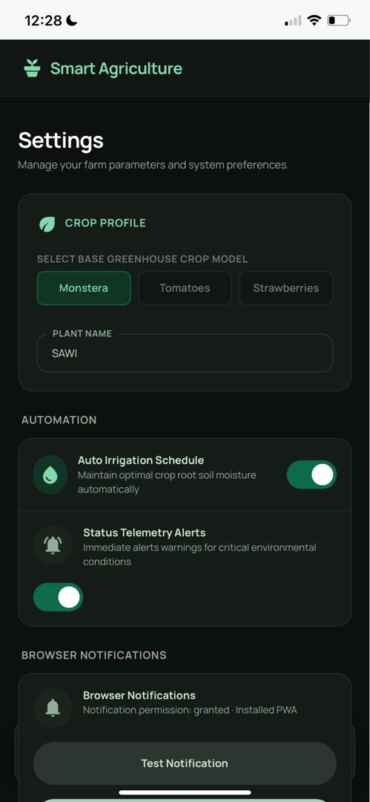

# Smart Agriculture Monitoring System

A final year project focused on smart agriculture monitoring, dashboard visualization, and data-supported farming decisions.

## Overview

This project explores how a smart agriculture system can help users monitor plant and farm conditions more effectively. It focuses on sensor-based monitoring, dashboard presentation, notifications, automatic irrigation support, and agriculture decision-making features.

## Features

- Soil moisture and environmental monitoring concept
- Dashboard for viewing current readings
- Trend page for reviewing sensor changes over time
- Automatic irrigation support
- Notifications for dry soil, pump activity, and fertilizer reminders
- AI fertilizer recommendation concept
- Survey evaluation and analysis

  ## Screenshots

### Dashboard

### Live Farm Readings

### Sensor Trend Analysis

### Irrigation Diagnostics

### Settings

## Project Materials

- `diagrams/` - System module diagram
- `manuscript/` - FYP manuscript and architecture figures
- `poster/` - Project poster in PNG, PDF, and editable PowerPoint format
- `portfolio-text/` - Portfolio-ready project description

## Portfolio Summary

Smart Agriculture Monitoring System is a final year project designed to support smarter and more sustainable farming practices through monitoring, visualization, and decision support features.

## Status

Documentation and portfolio materials uploaded. Source code can be added later if available.                                                                                                                                                                                                      
